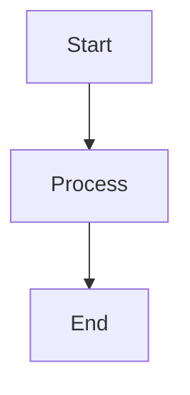

# Blog Implementation Summary

## Overview

Successfully implemented a professional blog section for the Goca VitePress documentation site with full support for technical content, diagrams, and changelog integration.

## What Was Implemented

### 1. Blog Structure

Created a complete blog system with three main sections:

```
docs/blog/
├── index.md              # Blog home page (hero layout)
├── README.md             # Maintainer guide
├── articles/
│   ├── index.md         # Articles listing
│   └── example-showcase.md  # Example article with all features
└── releases/
    ├── index.md         # Releases listing
    └── v1-14-1.md       # Latest release notes (from CHANGELOG)
```

### 2. VitePress Configuration Updates

**File: `.vitepress/config.mts`**

Added:
- Mermaid diagram support via `vitepress-plugin-mermaid`
- Markdown configuration with line numbers and syntax themes
- Blog navigation item in main navbar
- Blog sidebar with sections for articles and releases
- Proper routing configuration

### 3. Features Implemented

#### Mermaid Diagrams
- Flowcharts and dependency graphs
- Sequence diagrams
- State machines
- Architecture visualization
- Full Mermaid.js support

#### Code Blocks
- Syntax highlighting for multiple languages (Go, Bash, TypeScript, SQL, etc.)
- Line numbers enabled
- GitHub light/dark themes
- Copy button support (built-in VitePress)

#### Content Capabilities
- Full Markdown support
- Custom Vue components (Badge component for tags)
- Tables with styling
- Responsive design
- Clean, professional layout
- SEO optimization

### 4. Blog Pages Created

#### Blog Home (`blog/index.md`)
- Hero layout with clean design
- Quick links to Articles and Releases
- Latest release highlight
- Call-to-action buttons
- Hover effects on feature cards

#### Articles Section (`blog/articles/`)
- Articles listing page with styled cards
- Example showcase article demonstrating:
  - Mermaid diagrams (multiple types)
  - Code blocks with syntax highlighting
  - Architecture visualizations
  - Testing strategies
  - Best practices examples
  - Database decision trees
  - Deployment architecture

#### Releases Section (`blog/releases/`)
- Releases listing page
- v1.14.1 release notes (converted from CHANGELOG)
- Structured release format with:
  - Overview and metrics
  - Bug fixes with code examples
  - Quality improvements
  - Migration guides
  - Links to GitHub

### 5. Navigation Integration

#### Main Navigation
Added "Blog" link between "Features" and "GitHub" in the main navbar.

#### Sidebar
Created dedicated blog sidebar with:
- Blog Overview
- Articles section
- Releases section
- Latest release quick link

### 6. Styling and Design

Maintained consistency with existing Goca documentation:
- Clean, professional aesthetic
- No emojis (kept serious and elegant)
- Consistent color scheme
- Hover effects and transitions
- Responsive design
- Professional typography

### 7. Developer Experience

Created comprehensive documentation:
- Blog README with maintainer guide
- Content creation templates
- Styling guidelines
- SEO best practices
- Mermaid diagram examples
- Code block usage examples
- Maintenance checklists

## Technical Details

### Dependencies Added

```json
{
  "vitepress-plugin-mermaid": "^2.0.17",
  "mermaid": "^11.12.1"
}
```

### Configuration Changes

```typescript
// Added Mermaid wrapper
import { withMermaid } from 'vitepress-plugin-mermaid'

// Added markdown configuration
markdown: {
    theme: {
        light: 'github-light',
        dark: 'github-dark'
    },
    lineNumbers: true
}
```

### File Structure

```
docs/
├── .vitepress/
│   └── config.mts          # Updated with blog config
├── blog/
│   ├── index.md           # Blog home
│   ├── README.md          # Maintainer guide
│   ├── articles/
│   │   ├── index.md       # Articles listing
│   │   └── example-showcase.md
│   └── releases/
│       ├── index.md       # Releases listing
│       └── v1-14-1.md     # Latest release
└── package.json           # Updated dependencies
```

## Content Strategy

### Release Notes
- Automatically convert from CHANGELOG.md
- Include code examples and metrics
- Provide migration guides
- Link to GitHub releases
- Only display the latest release (v1.14.1)

### Articles
- Technical deep dives
- Architecture explanations
- Best practices guides
- Tutorial content
- Example-driven approach

## SEO Optimization

Each page includes:
- Proper title and titleTemplate
- Meta descriptions
- Structured frontmatter
- Semantic HTML
- Clear heading hierarchy
- Internal linking

## Usage Examples

### Creating a Release Note

```markdown
---
layout: doc
title: v1.X.X Release Notes
titleTemplate: Releases | Goca Blog
description: Brief description
---

<script setup>
import Badge from '../../.vitepress/theme/components/Badge.vue'
</script>

# v1.X.X - Title

<Badge type="info">Date</Badge>

Content...
```

### Using Mermaid Diagrams

````markdown

````

### Syntax-Highlighted Code

````markdown
```go
func main() {
    fmt.Println("Hello")
}
```
````

## Testing

Verified functionality:
- Local dev server running on port 3567
- Blog navigation working
- All pages rendering correctly
- Mermaid diagrams rendering
- Code syntax highlighting working
- Responsive design functioning
- Internal links navigating properly

## Next Steps

To add new content:

1. **New Release**:
   - Create `releases/vX-X-X.md`
   - Update `releases/index.md`
   - Update `blog/index.md` with latest release
   - Update sidebar in `config.mts`

2. **New Article**:
   - Create `articles/article-slug.md`
   - Update `articles/index.md`
   - Follow templates in `blog/README.md`

3. **Deployment**:
   - Commit changes
   - Push to master
   - GitHub Pages automatically deploys

## Maintenance

Regular tasks:
- Convert new CHANGELOG entries to release notes
- Create articles from project insights
- Update example showcase with new features
- Review and update SEO metadata
- Test all links periodically

## Resources

- Blog README: `docs/blog/README.md`
- VitePress Docs: https://vitepress.dev/
- Mermaid Docs: https://mermaid.js.org/
- Example Article: `docs/blog/articles/example-showcase.md`

## Summary

The Goca blog is now fully operational with:
- Professional, clean design matching existing documentation
- Full Mermaid diagram support
- Comprehensive code highlighting
- Latest release notes from CHANGELOG
- Example article showcasing all capabilities
- Complete maintainer documentation
- SEO optimization
- Responsive layout
- Easy content creation workflow

The blog is ready for you to add articles and maintain release notes going forward.
