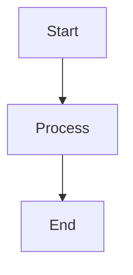

# Goca Blog - Quick Start Guide

## What's Been Implemented

A complete, professional blog system for the Goca documentation with:

- **Blog Home**: Hero layout at `/blog/` with clean design
- **Articles Section**: Technical articles at `/blog/articles/`
- **Releases Section**: Release notes at `/blog/releases/`
- **Latest Release**: v1.14.1 from CHANGELOG (October 27, 2025)
- **Example Article**: Full feature showcase with diagrams and code
- **Mermaid Support**: Full diagram capabilities
- **Code Highlighting**: Syntax highlighting for all languages
- **Clean Design**: No emojis, professional, elegant

## Quick Links

- Blog Home: [http://localhost:3567/goca/blog/](http://localhost:3567/goca/blog/)
- Articles: [http://localhost:3567/goca/blog/articles/](http://localhost:3567/goca/blog/articles/)
- Releases: [http://localhost:3567/goca/blog/releases/](http://localhost:3567/goca/blog/releases/)
- Latest Release: [http://localhost:3567/goca/blog/releases/v1-14-1](http://localhost:3567/goca/blog/releases/v1-14-1)
- Example Article: [http://localhost:3567/goca/blog/articles/example-showcase](http://localhost:3567/goca/blog/articles/example-showcase)

Note: These localhost links are for development only. In production, use relative paths without the base URL.

## File Structure

```
docs/blog/
├── index.md                        # Blog home (hero layout)
├── README.md                       # Complete maintainer guide
├── articles/
│   ├── index.md                   # Articles listing
│   └── example-showcase.md        # Example with all features
└── releases/
    ├── index.md                   # Releases listing
    └── v1-14-1.md                 # Latest release from CHANGELOG
```

## How to Add Content

### Add a New Release

1. Create `docs/blog/releases/vX-X-X.md`
2. Copy template from existing release or `blog/README.md`
3. Update `docs/blog/releases/index.md` (add to release list)
4. Update `docs/blog/index.md` (update "Latest Release" section)
5. Update `.vitepress/config.mts` sidebar (add to "Latest Release" items)

### Add a New Article

1. Create `docs/blog/articles/your-slug.md`
2. Use template from `blog/README.md` or copy from `example-showcase.md`
3. Update `docs/blog/articles/index.md` (add article card)

### Use Mermaid Diagrams

````markdown

````

### Add Code Blocks

````markdown
```go
func main() {
    fmt.Println("Hello")
}
```
````

## Configuration

**Location**: `docs/.vitepress/config.mts`

Key additions:
- Mermaid plugin integration
- Markdown config with line numbers
- Blog navigation in navbar
- Blog sidebar with sections
- GitHub light/dark themes

## Development

```bash
# Start dev server
cd docs
npm run dev
# Visit http://localhost:3567/goca/blog/

# Build for production
npm run build

# Preview build
npm run preview
```

## Features Available

### Content Types
- Markdown (.md) with VitePress enhancements
- Mermaid diagrams (flowcharts, sequences, state machines, etc.)
- Syntax-highlighted code blocks
- Tables
- Custom Vue components (Badge)
- LaTeX math (if needed in future)

### Diagram Types
- Flowcharts (`graph TD`, `graph LR`)
- Sequence diagrams
- Class diagrams
- State machines
- Entity relationships
- Gantt charts
- Pie charts
- Git graphs

### Supported Languages
Go, Bash, TypeScript, JavaScript, Python, SQL, JSON, YAML, Markdown, and many more.

## SEO & Meta

Each page includes:
```yaml
---
layout: doc
title: Page Title
titleTemplate: Section | Goca Blog
description: SEO description (150-160 chars)
---
```

## Design Principles

Maintained throughout:
- Clean, professional aesthetic
- No emojis (serious and elegant)
- Consistent with existing Goca documentation
- Responsive design
- Smooth transitions and hover effects
- Professional typography
- Clear information hierarchy

## Current Content

### Release Notes
- v1.14.1 (October 27, 2025) - Test Suite Improvements
  - Windows path handling fixes
  - Test reliability improvements
  - Module dependency corrections
  - 99.04% test success rate

### Articles
- Example showcase demonstrating all capabilities
- Ready for you to add more articles

## Next Steps

1. **Write More Articles**: Create technical content about Clean Architecture, testing, databases, etc.
2. **Add New Releases**: Convert future CHANGELOG entries to blog posts
3. **Customize**: Adjust styling or add new components as needed
4. **Deploy**: Push to master for automatic GitHub Pages deployment

## Resources

- **Maintainer Guide**: `docs/blog/README.md` (comprehensive)
- **Implementation Summary**: `docs/BLOG_IMPLEMENTATION.md` (technical details)
- **VitePress Docs**: https://vitepress.dev/
- **Mermaid Docs**: https://mermaid.js.org/

## Summary

The blog is fully operational and ready for content. All features work:
- Navigation integrated
- Pages rendering correctly
- Mermaid diagrams working
- Code highlighting functional
- Responsive design verified
- Hot reload working

Start writing and the blog will automatically update!
