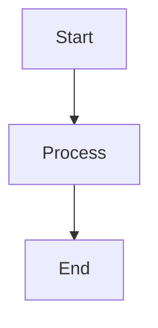

# Goca Blog

Professional blog section for the Goca documentation site, built with VitePress.

## Structure

```
blog/
├── index.md              # Blog home page
├── articles/             # Technical articles and tutorials
│   ├── index.md         # Articles listing page
│   └── *.md             # Individual article files
└── releases/            # Release notes and changelogs
    ├── index.md         # Releases listing page
    └── v*.md            # Version-specific release notes
```

## Features

### Supported Content Types

- **Markdown (.md)**: Full markdown support with VitePress enhancements
- **Mermaid Diagrams**: Flow charts, sequence diagrams, state machines, and more
- **Code Blocks**: Syntax highlighting for multiple languages
- **Tables**: Markdown tables with styling
- **Custom Components**: Vue components via VitePress theme

### Mermaid Diagram Support

Create diagrams using Mermaid syntax:

````markdown

````

Supported diagram types:
- Flowcharts (`graph TD`, `graph LR`)
- Sequence diagrams (`sequenceDiagram`)
- Class diagrams (`classDiagram`)
- State diagrams (`stateDiagram-v2`)
- Entity relationship diagrams (`erDiagram`)
- Gantt charts (`gantt`)
- Pie charts (`pie`)
- Git graphs (`gitGraph`)

### Code Blocks

Syntax highlighting for multiple languages:

````markdown
```go
func main() {
    fmt.Println("Hello, World!")
}
```

```bash
goca feature User --fields "name:string"
```

```typescript
interface User {
    id: number;
    name: string;
}
```
````

### Custom Badges

Use the Badge component for tags:

```markdown
<script setup>
import Badge from '../../.vitepress/theme/components/Badge.vue'
</script>

<Badge type="info">Release</Badge>
<Badge type="tip">Tutorial</Badge>
<Badge type="warning">Breaking</Badge>
<Badge type="danger">Deprecated</Badge>
```

## Creating New Content

### Writing a Release Note

1. Create file: `releases/v{major}-{minor}-{patch}.md`
2. Use this template:

```markdown
---
layout: doc
title: v1.X.X Release Notes
titleTemplate: Releases | Goca Blog
description: Brief description of the release
---

<script setup>
import Badge from '../../.vitepress/theme/components/Badge.vue'
</script>

# v1.X.X - Release Name

<Badge type="info">Date</Badge>
<Badge type="tip">Feature</Badge>

## Overview

Brief overview of the release...

## New Features

### Feature Name

Description and examples...

## Bug Fixes

### Fix Description

Details...

## Migration Guide

If applicable, provide migration steps...

---

<div style="text-align: center; margin-top: 3rem; padding-top: 2rem; border-top: 1px solid var(--vp-c-divider);">

**Released on [Date]**

[View on GitHub](...) • [Download](...) • [Report Issue](...)

</div>
```

3. Update `releases/index.md` with the new release entry
4. Update `blog/index.md` with the latest release link
5. Update sidebar in `.vitepress/config.mts`

### Writing an Article

1. Create file: `articles/article-slug.md`
2. Use this template:

```markdown
---
layout: doc
title: Article Title
titleTemplate: Articles | Goca Blog
description: Brief description for SEO
---

<script setup>
import Badge from '../../.vitepress/theme/components/Badge.vue'
</script>

# Article Title

<Badge type="tip">Category</Badge>
<Badge type="info">Tags</Badge>

Your content here...

## Section 1

Content...

## Section 2

More content...

---

<div style="text-align: center; margin-top: 3rem; padding-top: 2rem; border-top: 1px solid var(--vp-c-divider);">

**Author • Date**

[Edit on GitHub](...) • [Report Issue](...)

</div>
```

3. Update `articles/index.md` with the new article entry

## Styling Guidelines

### CRITICAL: Link Format

All internal blog links **MUST** include the `/goca/` base path:

```markdown
✅ CORRECT:
[Article](/goca/blog/articles/example-showcase)
<a href="/goca/blog/releases/v1-14-1">Release</a>

❌ WRONG (causes 404):
[Article](/blog/articles/example-showcase)
<a href="/blog/releases/v1-14-1">Release</a>
```

**Why**: VitePress uses `base: '/goca/'` in config.mts. While navigation items get the base path automatically, HTML anchor tags and markdown links require explicit `/goca/` prefix.

**Validation**: Run `npm run validate-links` before committing to catch broken links.

### Consistency

- Use clean, professional language
- Maintain consistent heading hierarchy (H1 → H2 → H3)
- Use code blocks for all code examples
- Include diagrams where helpful
- Use tables for structured comparisons

### SEO Best Practices

Always include frontmatter:

```yaml
---
layout: doc
title: Page Title (for browser tab)
titleTemplate: Section | Goca Blog
description: Clear description for search engines (150-160 chars)
---
```

### Code Examples

- Use syntax highlighting
- Include comments for clarity
- Show before/after for fixes
- Provide complete, runnable examples where possible

### Diagrams

- Keep diagrams simple and focused
- Use consistent color schemes
- Add explanatory notes where needed
- Test rendering before committing

## Development

### Local Preview

```bash
cd docs
npm run docs:dev
# Visit http://localhost:3567/goca/blog/
```

### Build

```bash
cd docs
npm run docs:build
```

### Deploy

The blog is automatically deployed with the main documentation site through GitHub Pages.

## Maintenance

### Regular Tasks

1. **New Releases**: Create release notes from CHANGELOG.md
2. **Update Indexes**: Keep listing pages current
3. **Fix Links**: Ensure all internal links work
4. **Update Examples**: Keep code examples current with latest version
5. **Review SEO**: Check titles, descriptions, and meta tags

### Content Review Checklist

Before publishing:

- [ ] Frontmatter complete and accurate
- [ ] All code examples tested
- [ ] Diagrams render correctly
- [ ] Links work (internal and external)
- [ ] Images optimized and have alt text
- [ ] Grammar and spelling checked
- [ ] Mobile-responsive formatting
- [ ] SEO description under 160 characters
- [ ] Related articles linked

## Resources

- [VitePress Documentation](https://vitepress.dev/)
- [Mermaid Documentation](https://mermaid.js.org/)
- [Markdown Guide](https://www.markdownguide.org/)
- [Goca Documentation Style Guide](../STYLE_GUIDE.md)

## Contact

For questions or suggestions about the blog:

- Open an issue: https://github.com/sazardev/goca/issues
- Discussions: https://github.com/sazardev/goca/discussions
