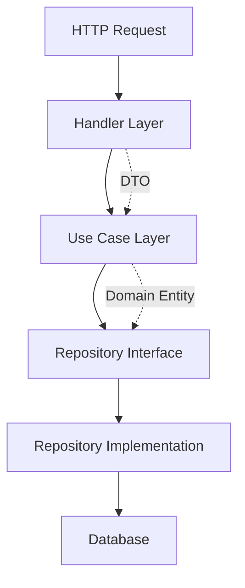
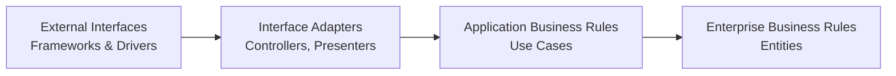
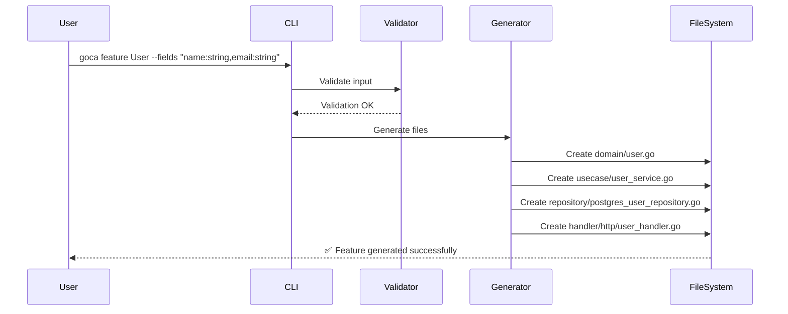
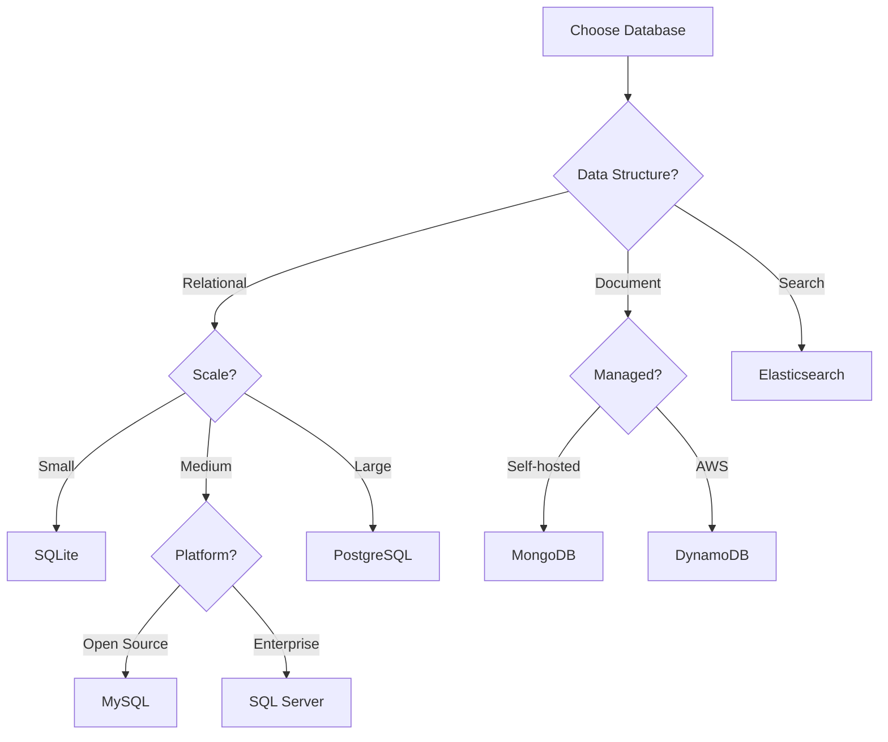
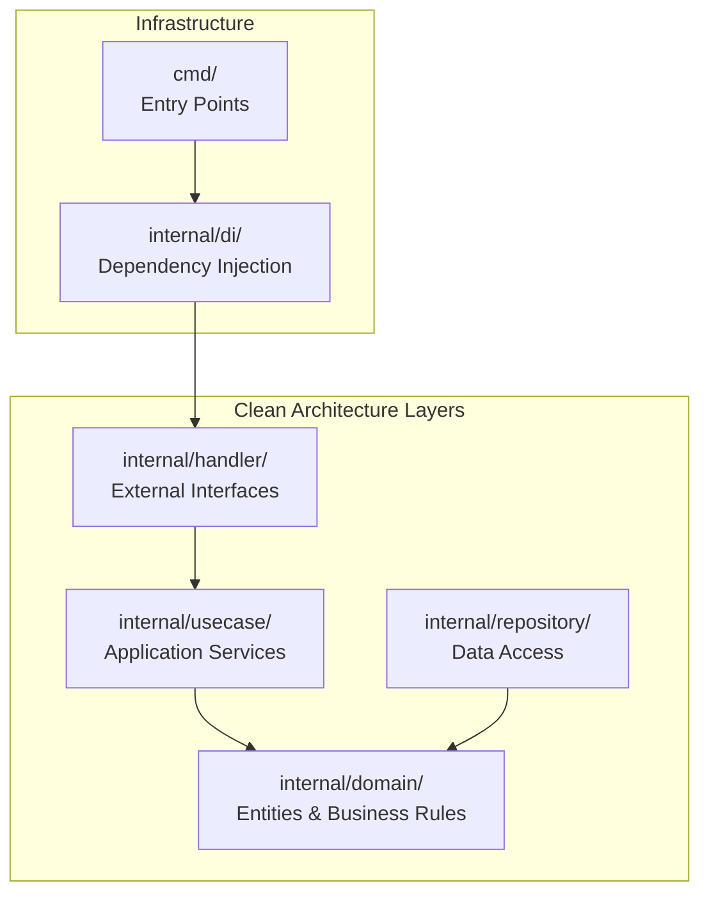
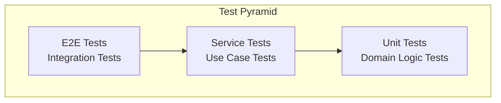
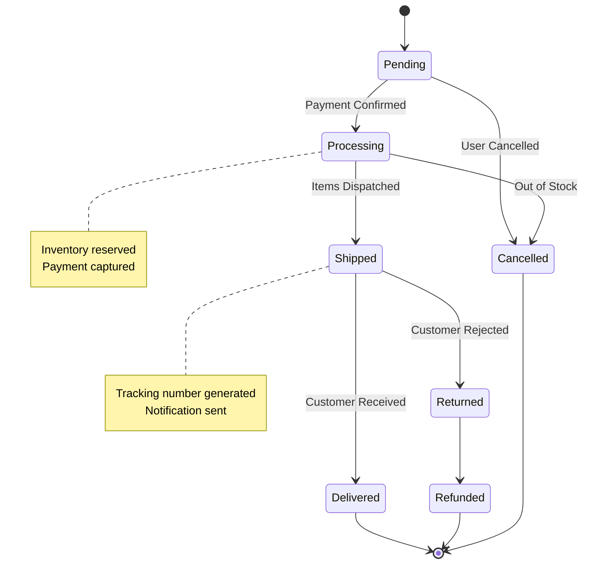
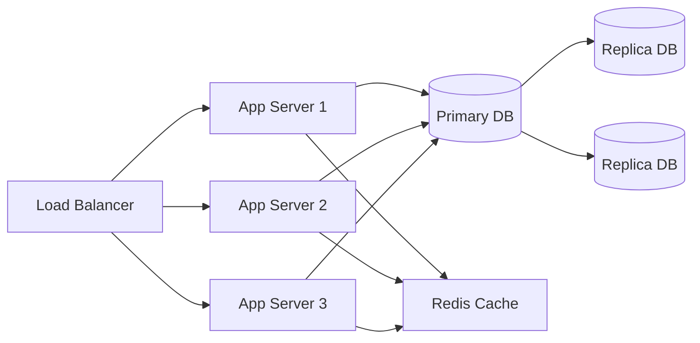

<script setup>
import Badge from '../../.vitepress/theme/components/Badge.vue'
</script>

# Advanced Features Showcase

<div style="display: flex; gap: 0.5rem; margin-bottom: 1rem;">
<Badge type="tip">Example</Badge>
<Badge type="info">Tutorial</Badge>
</div>

This is an example article demonstrating the full capabilities of the Goca blog system, including Mermaid diagrams, syntax-highlighted code blocks, and advanced markdown features.

---

## Clean Architecture Flow

Here's how Goca implements Clean Architecture principles using a Mermaid diagram:



### Layer Dependencies

The dependency rule states that source code dependencies must point inward:



## Code Generation Workflow

### Entity Generation Process

```go
// Generate an entity with Goca
package main

import (
    "fmt"
    "time"
)

// User represents a user entity in the domain layer
type User struct {
    ID        uint      `json:"id" gorm:"primaryKey"`
    Name      string    `json:"name" gorm:"type:varchar(255);not null"`
    Email     string    `json:"email" gorm:"type:varchar(255);uniqueIndex;not null"`
    CreatedAt time.Time `json:"created_at" gorm:"autoCreateTime"`
    UpdatedAt time.Time `json:"updated_at" gorm:"autoUpdateTime"`
}

// Validate performs business logic validation
func (u *User) Validate() error {
    if u.Name == "" {
        return fmt.Errorf("name cannot be empty")
    }
    if u.Email == "" {
        return fmt.Errorf("email cannot be empty")
    }
    return nil
}
```

### Command Execution Sequence



## Database Support Matrix

Goca supports multiple databases with specific implementations:

| Database        | Type         | Primary Use Case | Status   |
| --------------- | ------------ | ---------------- | -------- |
| PostgreSQL      | SQL          | OLTP/General     | ✅ Stable |
| PostgreSQL JSON | SQL+Document | Semi-structured  | ✅ Stable |
| MySQL           | SQL          | Web Applications | ✅ Stable |
| MongoDB         | NoSQL        | Document Store   | ✅ Stable |
| SQLite          | SQL          | Embedded/Testing | ✅ Stable |
| SQL Server      | SQL          | Enterprise       | ✅ Stable |
| Elasticsearch   | Search       | Full-text Search | ✅ Stable |
| DynamoDB        | NoSQL        | Serverless AWS   | ✅ Stable |

### Database Selection Decision Tree



## Project Structure Visualization



## Testing Strategy

### Test Pyramid



### Test Coverage by Layer

```bash
# Run tests with coverage
go test ./internal/domain/... -cover
# PASS coverage: 95.2% of statements

go test ./internal/usecase/... -cover
# PASS coverage: 89.7% of statements

go test ./internal/repository/... -cover
# PASS coverage: 78.4% of statements

go test ./internal/handler/... -cover
# PASS coverage: 82.1% of statements
```

## Best Practices

### Repository Pattern Implementation

```go
// Repository interface (domain layer)
type UserRepository interface {
    Save(ctx context.Context, user *User) error
    FindByID(ctx context.Context, id uint) (*User, error)
    Update(ctx context.Context, user *User) error
    Delete(ctx context.Context, id uint) error
    FindAll(ctx context.Context) ([]*User, error)
}

// PostgreSQL implementation (infrastructure layer)
type postgresUserRepository struct {
    db *gorm.DB
}

func (r *postgresUserRepository) Save(ctx context.Context, user *User) error {
    return r.db.WithContext(ctx).Create(user).Error
}

func (r *postgresUserRepository) FindByID(ctx context.Context, id uint) (*User, error) {
    var user User
    if err := r.db.WithContext(ctx).First(&user, id).Error; err != nil {
        if errors.Is(err, gorm.ErrRecordNotFound) {
            return nil, fmt.Errorf("user not found")
        }
        return nil, err
    }
    return &user, nil
}
```

### Use Case Pattern

```go
type UserUseCase interface {
    CreateUser(ctx context.Context, input CreateUserInput) (*UserOutput, error)
    GetUser(ctx context.Context, id uint) (*UserOutput, error)
    UpdateUser(ctx context.Context, input UpdateUserInput) (*UserOutput, error)
    DeleteUser(ctx context.Context, id uint) error
    ListUsers(ctx context.Context) ([]*UserOutput, error)
}

type userService struct {
    repo UserRepository
}

func (s *userService) CreateUser(ctx context.Context, input CreateUserInput) (*UserOutput, error) {
    // 1. Validate input
    if err := input.Validate(); err != nil {
        return nil, err
    }
    
    // 2. Create domain entity
    user := &User{
        Name:  input.Name,
        Email: input.Email,
    }
    
    // 3. Validate entity
    if err := user.Validate(); err != nil {
        return nil, err
    }
    
    // 4. Save to repository
    if err := s.repo.Save(ctx, user); err != nil {
        return nil, err
    }
    
    // 5. Return output DTO
    return &UserOutput{
        ID:        user.ID,
        Name:      user.Name,
        Email:     user.Email,
        CreatedAt: user.CreatedAt,
    }, nil
}
```

## Command Reference Quick Guide

```bash
# Initialize new project
goca init myproject --database postgres

# Generate complete feature
goca feature User --fields "name:string,email:string,age:int"

# Generate with testing support
goca feature Product --fields "name:string,price:float64" \
    --integration-tests --mocks

# Generate only entity
goca entity Order --fields "total:float64,status:string"

# Generate repository
goca repository User --database postgres

# Generate handler
goca handler User --type http

# Wire everything together
goca integrate --all

# Generate dependency injection
goca di
```

## State Machine Example

Here's how you might model an order state machine:



## Performance Considerations

### Database Query Optimization

```sql
-- Before: N+1 query problem
SELECT * FROM users WHERE id = 1;
SELECT * FROM orders WHERE user_id = 1;
SELECT * FROM orders WHERE user_id = 2;
SELECT * FROM orders WHERE user_id = 3;

-- After: Single query with join
SELECT u.*, o.*
FROM users u
LEFT JOIN orders o ON u.id = o.user_id
WHERE u.id IN (1, 2, 3);
```

```go
// Use GORM preloading to avoid N+1
var users []User
db.Preload("Orders").Find(&users)
```

## Deployment Architecture



## Conclusion

This example demonstrates the powerful capabilities available in Goca blog posts:

- Mermaid diagrams for architecture visualization
- Syntax-highlighted code blocks
- Tables and structured data
- State machines and flow diagrams
- Sequence diagrams
- Best practices and patterns

Use these features to create comprehensive, professional documentation and blog posts for your Goca projects.

---

<div style="text-align: center; margin-top: 3rem; padding-top: 2rem; border-top: 1px solid var(--vp-c-divider);">

[Edit on GitHub](https://github.com/sazardev/goca/edit/master/docs/blog/articles/example-showcase.md) • [Report Issue](https://github.com/sazardev/goca/issues)

</div>
